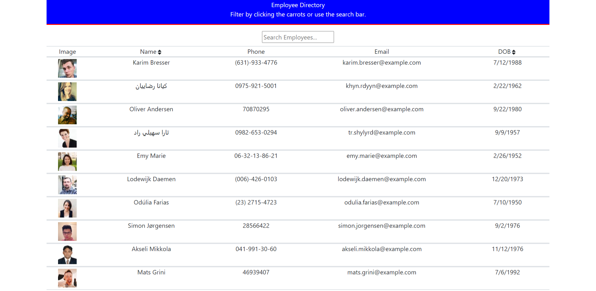

# Employee Directory

## Description

This app allows managers or employees to view non-sensitive information about other employees in the company. The app features filter and sorting functionality in ascending or descending order.

## Table of Contents

-   [Installation Instructions](#installation-instructions)
-   [Usage Information](#usage-information)
-   [License](#license)
-   [Contribution Guidelines](#contribution-guidelines)
-   [Test Instructions](#test-instructions)
-   [Questions](#questions)

## Installation Instructions

This app will be deployed to heroku where it is fully functional without any installation. If you want to download the app locally you will need to run npm install in the root directory to install all dependencies for the project.

## Usage Information

The app can be used by filtering the employees with the search bar or sorting the employees by clicking the caret next to the name or date of birth fields.

## License

This project is not utilizing a license

## Contribution Guidelines

This project is fully open source, any pull requests for improvements will be reviewed.

## Test Instructions

This app does not utilize tests

## Questions

If there are further questions please contact me with the following.

 AndrewMorrow- <a href="https://github.com/AndrewMorrow" target= "_blank">Github</a>

Email: beardedmongo@gmail.com
